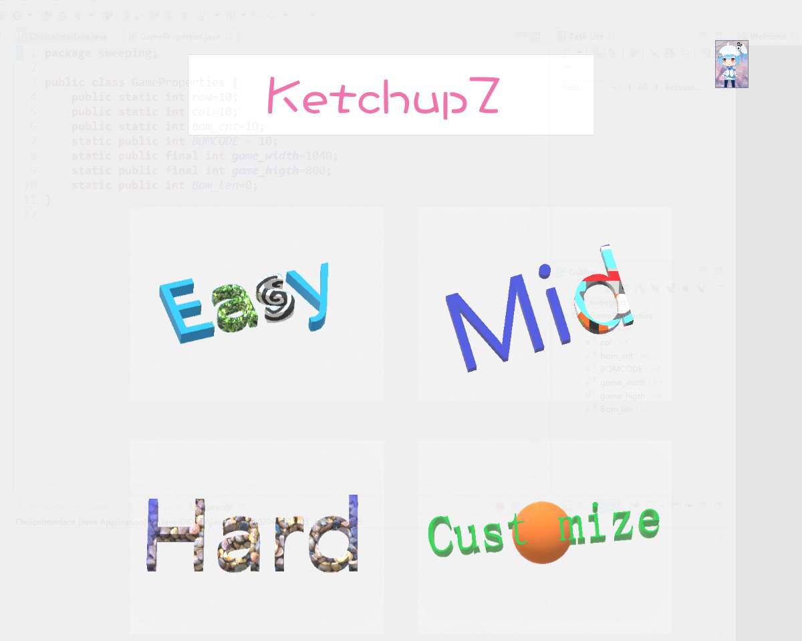
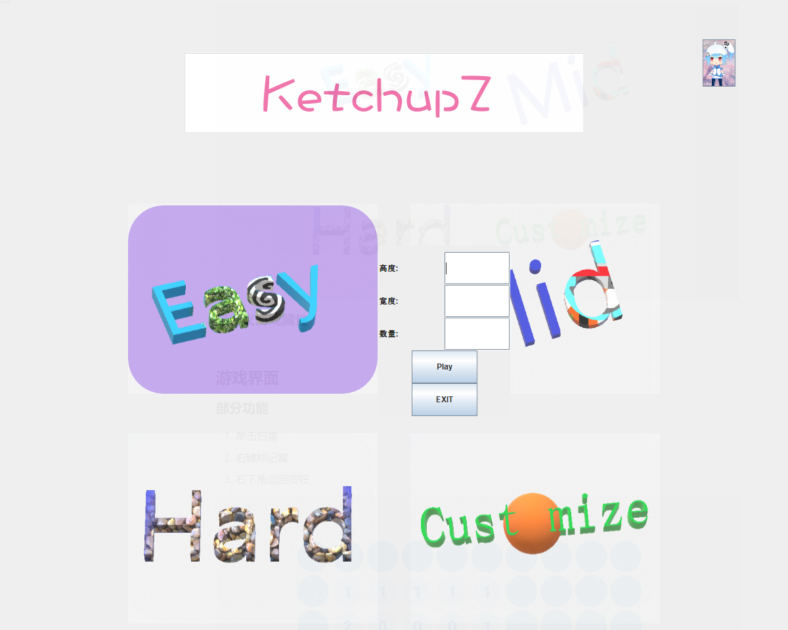
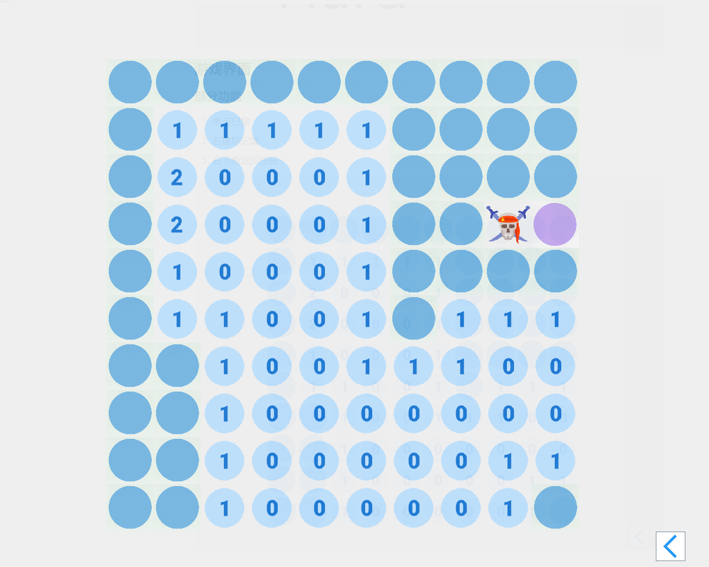

# mine-sweeping-
## introduction

Java语言编写，使用Swing框架模仿Microsoft shop的"扫雷S"游戏，项目使用的`jdk`是`JAVASE-11`。

`clearbom`就是项目文件夹。

这个项目是为了应付当时的Java课设，架构上有所不足，但是游戏功能和界面还是挺好玩的。(用了C++写GUI界面之后才发现`Java`的`Swing`框架是多好)

## The game picture

### 开始界面

#### 部分功能

1. 选择难度
2. 自定义难度
3. 右上角退出按钮

#### 自定义游戏属性

### 游戏界面

#### 部分功能

1. 单击扫雷
2. 右键标记雷
3. 右下角返回按钮

## final

noting